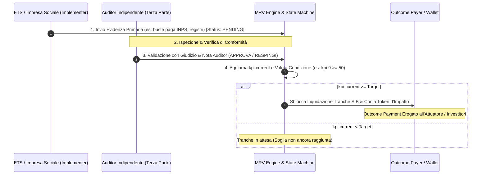
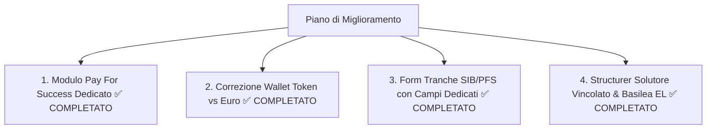

# Documentazione Tecnica: Calcoli, Formule, Agenti AI & Modelli Pay For Success (PFS)

Questo documento contiene la mappatura esaustiva di **tutte le formule matematiche e finanziarie**, l'analisi critica dei **modelli di finanziamento ad impatto (SIB & Pay for Success)**, la risoluzione delle incongruenze tra **Token di Outcome ed euro nel Wallet**, e il piano di miglioramento algoritmico della piattaforma **Impact Forge**.

---

## 1. Mappatura & Spiegazione delle Formule Finanziarie ed Economiche

### Modulo A: Blended Finance & Sostenibilità Finanziaria ([`src/lib/finance.ts`](file:///c:/Users/user/Desktop/ai-arena-impact-venture-building-platform-deepseek-v4-pro-max/src/lib/finance.ts))

#### 1. Leva Finanziaria Blended (`leverage`)
* **Obiettivo**: Misurare quanti euro di capitale complessivo attrae ogni euro di grant pubblico/filantropico a fondo perduto.
* **Dati usati**: `tranches[].amount`, `tranches[].instrument`.
* **Formula**:
  $$\text{Leva} = \begin{cases} \frac{\text{Total Funding}}{\text{Grant Funding}}, & \text{se Grant} > 0 \\ 0, & \text{se Grant} = 0 \end{cases}$$
  *Dove* $\text{Total Funding} = \sum_{\text{tranche} \neq \text{GUARANTEE}} \text{amount}$.
* **Dove si visualizza nell'App**: Nella scheda **Finanza Blended** del progetto (statistica in alto e indicatore sotto la waterfall) e nella scheda **Underwriting**.

#### 2. WACC Blended (Weighted Average Cost of Capital) (`wacc`)
* **Obiettivo**: Calcolare il costo medio ponderato del capitale della struttura finanziaria mista.
* **Dati usati**: `tranches[].amount`, `INSTRUMENT_META[instrument].cost`.
* **Formula**:
  $$\text{WACC} = \frac{\sum_{i=1}^{N} (\text{amount}_i \times \text{cost}_i)}{\text{Total Funding}}$$
  *Costi convenzionali adottati*: Grant = $0\%$, Prestito Agevolato = $2.0\%$, Debito Senior = $6.5\%$, Garanzia = $1.2\%$, Equity = $12.0\%$, SIB = $15.0\%$, RevShare = $5.0\%$, Community Shares = $4.0\%$.
* **Dove si visualizza nell'App**: Nella scheda **Finanza Blended** (badge statistica "WACC blended").

#### 3. Rata Annua di Ammortamento Francese (`annuity`)
* **Obiettivo**: Calcolare la quota costante annua (capitale + interessi) per i finanziamenti a debito.
* **Dati usati**: $P$ = `tranche.amount`, $r$ = `tranche.ratePct / 100`, $n$ = `round(maturityMonths / 12)`.
* **Formula**:
  $$A = \begin{cases} \frac{P \cdot r \cdot (1+r)^n}{(1+r)^n - 1}, & \text{se } r > 0 \text{ e } n > 0 \\ \frac{P}{n}, & \text{se } r = 0 \text{ e } n > 0 \end{cases}$$
* **Dove si visualizza nell'App**: Nella tabella "Piano ammortamento (rata annua)" sotto la waterfall delle tranche in **Finanza Blended**.

#### 4. Servizio Totale del Debito Annuo (`debtService`)
* **Obiettivo**: Somma di tutte le rate annue dovute per le tranche di debito agevolato e senior.
* **Formula**: $\text{Debt Service} = \sum \text{annuity}_i$.
* **Dove si visualizza nell'App**: Nel riquadro "Copertura fabbisogno" (Rata annua debito).

#### 5. Margine Operativo Netto (`noi`)
* **Dati usati**: `project.annualRevenue`, `project.annualOpex`.
* **Formula**: $\text{NOI} = \text{Annual Revenue} - \text{Annual Opex}$.

#### 6. DSCR (Debt Service Coverage Ratio) (`dscr`)
* **Obiettivo**: Verificare la sostenibilità del debito tramite i flussi di cassa operativi netti (soglia minima prudenziale $\ge 1.20$).
* **Formula**: $\text{DSCR} = \frac{\text{NOI}}{\text{Debt Service}}$ (se $\text{Debt Service} > 0$).
* **Dove si visualizza nell'App**: Nelle statistiche in cima a **Finanza Blended** e nel riquadro Expected Loss di **Underwriting**.

#### 7. Proiezione Anni di Rientro / Payback (`breakEvenYears`)
* **Obiettivo**: Calcolare il tempo (in anni) necessario per recuperare il capitale investito tramite il margine operativo netto annuo (NOI).
* **Dati usati**: `project.annualRevenue`, `project.annualOpex`, `f.total`, `f.grant`.
* **Formule**:
  - **Payback con Grant (Capitale Privato)**:
    $$\text{Payback}_{\text{con Grant}} = \frac{\text{Total Funding} - \text{Grant Funding}}{\text{NOI}}$$
  - **Payback senza Grant (100% Funding)**:
    $$\text{Payback}_{\text{senza Grant}} = \frac{\text{Total Funding}}{\text{NOI}}$$
* **Dove si visualizza e si attiva nell'App**:
  - **Posizione**: Nella scheda **Finanza Blended** del progetto ([`src/components/finance-builder.tsx`](file:///c:/Users/user/Desktop/ai-arena-impact-venture-building-platform-deepseek-v4-pro-max/src/components/finance-builder.tsx)), colonna destra sotto "Copertura fabbisogno".
  - **Attivazione**: Si aggiorna in tempo reale modificando i parametri **Ricavi annui**, **Costi operativi annui** o aggiungendo/rimuovendo tranche di finanziamento.

---

### Modulo B: Impact MRV & Valutazione Economico-Sociale ([`src/lib/finance.ts`](file:///c:/Users/user/Desktop/ai-arena-impact-venture-building-platform-deepseek-v4-pro-max/src/lib/finance.ts))

#### 8. Valore Sociale Monetizzato Annuo e a 5 Anni (`sroiSocialValue`)
* **Dati usati**: `kpis[].current` (quantità realizzata e validata), `kpis[].valuePerUnit` (valore economico unitario proxy IRIS+ / BES).
* **Formula Annua**: $V_{\text{sociale, 1y}} = \sum_{j=1}^{K} (\text{current}_j \times \text{valuePerUnit}_j)$
* **Formula a 5 Anni**: $V_{\text{sociale, 5y}} = V_{\text{sociale, 1y}} \times 5$
* **Dove si visualizza nell'App**: Nella scheda **MRV & Impatto** (Card centrale "Valore sociale monetizzato").

#### 9. SROI Dinamico Netto (`computeSroi`)
* **Obiettivo**: Ritorno netto sull'investimento sociale generato in 5 anni per ogni euro investito.
* **Formula**: $\text{SROI} = \frac{V_{\text{sociale, 5y}} - \text{Total Funding}}{\text{Total Funding}}$
* **Dove si visualizza nell'App**: Nella scheda **MRV & Impatto** (Card "SROI dinamico") e nella **Landing Page** pubblica.

#### 10. Progresso di Conseguimento del Singolo KPI (`kpiProgress`)
* **Formula**: $\text{Progress} = \min\left(1.0, \max\left(0.0, \frac{\text{current}}{\text{target}}\right)\right)$
* **Dove si visualizza nell'App**: Barre di avanzamento percentuale accanto a ciascun KPI in **MRV & Impatto**.

#### 11. Alert Scostamento KPI a Metà Timeline (`kpiAlerts`)
* **Regola**: Genera alert se $\text{Progress} < 0.70$ prima della conclusione del progetto.

---

### Modulo C: Underwriting & Gestione Rischio ([`src/lib/finance.ts`](file:///c:/Users/user/Desktop/ai-arena-impact-venture-building-platform-deepseek-v4-pro-max/src/lib/finance.ts), [`src/lib/agents.ts`](file:///c:/Users/user/Desktop/ai-arena-impact-venture-building-platform-deepseek-v4-pro-max/src/lib/agents.ts))

#### 12. Score Integrato di Merito (`underwritingFinalScore`)
* **Formula**: $\text{Final Score} = 0.55 \times \text{creditScore} + 0.45 \times \text{impactScore}$
* **Dove si visualizza nell'App**: Nella scheda **Underwriting** (anello centrale "Score integrato", soglia approvazione $\ge 60$).

#### 13. Impact Score Euristico (`underwriterAgent`)
* **Formula**: $\text{Impact Score} = 0.50 \times \text{TaxonomyPct} + 0.30 \times (\text{avgKpiProgress} \times 100) + 0.20 \times (\text{DNSH} ? 100 : 40)$

#### 14. Expected Loss (Perdita Attesa) Base e Mitigata (`underwriterAgent`)
* **Formula Base**: $\text{EL}_{\text{base}} = \max\left(0, \frac{100 - \text{creditScore}}{100} \times 0.22\right)$
* **Formula Mitigata da Garanzia**: $\text{EL}_{\text{mitigata}} = \max\left(0, \text{EL}_{\text{base}} - \frac{\text{maxGuaranteePct}}{100} \times 0.15\right)$

---

### Modulo D: Need Sensing & Opportunity Score ([`src/actions.ts`](file:///c:/Users/user/Desktop/ai-arena-impact-venture-building-platform-deepseek-v4-pro-max/src/actions.ts))

#### 15. Opportunity Score di Origination (`addOpportunity`)
* **Formula**: $\text{Opp Score} = \min\left(100, \text{round}\left(\text{gravity} \times 7 + \min\left(25, \frac{\text{economicPotential}}{1\,000\,000} \times 8\right) + (\text{hasAssets} ? 10 : 0)\right)\right)$
* **Dove si visualizza nell'App**: Nel **Radar Opportunità** (`/dashboard/opportunities`).

---

## 2. Analisi Critica: SIB, Finanziamenti ad Impatto & Pay For Success (PFS)

### A. Come funziona attualmente il SIB nell'App (e limiti concettuali)
Nel progetto demo *Scuola dei Mestieri Digitali* (Puglia - Taranto), è presente una tranche:
> *"SIB / Outcome Payment Comune di Taranto · 5 anni · condizione: Outcome verificato da PA: kpi:9 >= 60 · 200 k€"*

---

### A. Come funziona attualmente il SIB nell'App e Correzione dei Limiti Concettuali

Nel progetto demo *Scuola dei Mestieri Digitali* (Puglia - Taranto), è configurata la seguente tranche contrattuale:
> *"SIB / Outcome Payment Comune di Taranto · 5 anni · condizione: Outcome verificato da PA: kpi:9 >= 60 · 200 k€"*
> *L'esempio è con la PA (Taranto) ma qualsiasi fonte di finanziamento che preveda un rimborso legato al raggiungimento di risultati misurabili si definisce **Pay for Success** ma nell'applicazione qualsiasi finanziatore può erogare fondi*.* 

#### Incongruenza concettuale e contabile riscontrata:
- Nel codice dell'applicazione (`src/lib/finance.ts`), la tranche SIB viene sommata direttamente nel **Funding Totale iniziale** (`f.total`) come se fosse capitale liquido disponibile al tempo $t_0$ per coprire le spese di investimento e funzionamento (CAPEX/OPEX).
- **Errore di modellizzazione**: In un **Social Impact Bond (SIB)** (noto negli standard internazionali anche come *Social Outcome Partnership* o *Pay for Success Bond*), l'**Outcome Payer** (la Pubblica Amministrazione, es. Comune di Taranto) **non eroga capitale di cassa anticipato**. L'Ente pubblico assume unicamente un'obbligazione condizionata a debito differito (*contingent liability*), impegnandosi a versare l'**Outcome Payment** esclusivamente *ex-post*, a fronte del raggiungimento e della validazione degli outcome prefissati da parte di un **Valutatore Indipendente (Third-Party Independent Evaluator / MRV Engine)**.

#### Struttura finanziaria corretta del SIB (Best Practice OECD & Oxford GO Lab):
1. **Fase di Avvio ($t_0$) - Capitale Operativo (*Working Capital*)**: Il fabbisogno iniziale (CAPEX + OPEX) deve essere coperto da **Investitori di Impatto Privati / Istituzionali** (tramite debito subordinato/mezzanino, prestiti ponte, capitale di rischio o veicoli societari dedicati SPV - *Special Purpose Vehicle*).
2. **Fase di Esecuzione ($t_1 \dots t_n$)**: L'Attuatore (*Service Provider* / ETS) eroga l'intervento impiegando la liquidità fornita dagli investitori.
3. **Fase di Verifica ($t_n$)**: Il Valutatore Indipendente misura e certifica il valore del target raggiunto (es. $\text{KPI}_9 \ge 60$ inserimenti stabili).
4. **Fase di Liquidazione Finale ($t_n$)**:
   - **Se il target è raggiunto**: La PA liquida l'Outcome Payment ($200\text{ k€}$). Questo flusso di cassa viene destinato prioritariamente a rimborsare il capitale anticipato dagli investitori (*Principal Repayment*) maggiorato del tasso di rendimento concordato (*Success Premium / Financial Return*, parametrato al risparmio pubblico generato); l'eventuale residuo remunera l'Attuatore (*Performance Bonus*).
   - **Se il target NON è raggiunto**: La PA non sborsa alcuna somma pubblica; gli investitori subiscono la perdita parziale o totale del capitale investito (trasferimento del rischio di performance finanziaria dal settore pubblico al mercato privato dei capitali).

---

### B. Finanziamenti ad Impatto Diretti: "Direct Pay For Success" (PFS / Direct PbR) non-SIB

I contratti ad impatto non richiedono obbligatoriamente l'intermediazione finanziaria complessa di terzi investitori o la costituzione di una SPV:

#### Caratteristiche del Modello Bipartito Diretto:
- **Relazione Contrattuale**: Un finanziatore pubblico o filantropico (*Outcome Payer*, es. PA o Fondazione di Origine Bancaria) stipula un contratto di servizio ad esito (*Direct Outcomes Contract*) direttamente con l'Ente Attuatore (ETS / Impresa Sociale / Consorzio).
- **Assorbimento del Rischio Operativo**: L'Attuatore finanzia l'avvio e la gestione mediante risorse proprie di cassa, linee di credito bancario ordinarie, microcredito garantito o anticipazioni parziali a fondo perduto (*hybrid grant-outcome contracts*).
- **Riconoscimento Economico a Stato Avanzamento Lavori (SAL ad Outcome)**: Man mano che l'Attuatore genera e certifica outcome intermedi e finali nel corso del programma (es. scaglioni di 10 inserimenti lavorativi certificati a 6 mesi, o 20 nuclei familiari usciti dalla soglia ISEE di vulnerabilità), l'Outcome Payer eroga quote progressive di **Outcome Payment**.
- **Qualificazione Contabile**:
  - Per l'**Attuatore**: Il pagamento costituisce un **ricavo da prestazioni e servizi a tariffa d'impatto (*Earned Impact Revenue*)**, maturato per competenza e incassato per cassa in funzione dell'efficacia certificata.
  - Per il **Finanziatore / PA**: Costituisce un'uscita di spesa corrente condizionata (*Contingent Performance Expenditure*), fiscalmente e socialmente giustificata dal controvalore economico dei costi pubblici evitati (*Cashable Public Savings*).

---

### C. Riepilogo Operativo per l'Implementazione nell'Architettura Software

| Dimensione di Analisi | Social Impact Bond (SIB / SOP) | Direct Pay for Success (Direct PbR) |
| :--- | :--- | :--- |
| **Attori Chiave** | Quadripartito: PA (Outcome Payer), Investitori d'Impatto, Attuatore (ETS), Valutatore Indipendente (MRV) | Bipartito/Tripartito: PA/Fondazione (Outcome Payer), Attuatore (ETS), Valutatore Indipendente |
| **Trattamento nel Cashflow ($t_0$)** | **Inflow da Investitori Privati** (Debito / Capitale Ponte). *Non inserire il budget PA nel funding iniziale.* | **Risorse Proprie / Anticipazione Bancaria / Tranche Base (Grant)**. *Nessun anticipo dall'Outcome Payer.* |
| **Flusso dell'Outcome Payment ($t_n$)** | PA (es Taranto ma può essere anche la fondazione o una impresa privata che finanzia l'intervento) $\rightarrow$ Investitori (Rimborso Capitale + *Success Premium*) + Eventuale quota *Success Fee* all'Attuatore. | PA $\rightarrow$ Attuatore (*Revenue operativo diretto* legato alle metriche d'impatto validate). |
| **Profilo di Rischio Finanziario** | Trasferito integralmente o parzialmente agli **Investitori Privati**. | Trattenuto in capo all'**Attuatore (ETS / Fornitore di servizi)**. |
| **Modellazione in `finance.ts`** | Trattare il SIB come `Contingent_Receivable` a scadenza e inserire nel $t_0$ una voce di `Bridge_Impact_Investment`. | Trattare l'Outcome Payment come `Milestone_Revenue` variabile associato al motore di valutazione (`mrvEngine.evaluate()`). |

---


### C. Metodologie e Calcoli per i Progetti "Pay For Success" & SIB Applicati nella Piattaforma

Nel progetto *Scuola dei Mestieri Digitali* (e per i progetti a risultato con Payer istituzionali o privati), la piattaforma applica il seguente modello analitico integrato nel form di **Stima Controfattuale**:

```
┌─────────────────────────────────────────────────────────────────────────────────────────────┐
│                          MODELLO FINANZIARIO PAY FOR SUCCESS & SIB                           │
├─────────────────────────────────────────────────────────────────────────────────────────────┤
│ 1. PLAFOND OUTCOME PAYMENT : 600.000 € (Impegno max del Payer: Banca/PA/Fondazione)         │
│ 2. TARGET OUTCOME          : 60 giovani NEET inseriti stabilmente nel mondo del lavoro       │
│                                                                                             │
│ 3. COSTO UNITARIO OUTCOME  : 10.000 €/un.  [ Budget Speso / Plafond ÷ Target Outcome ]     │
│    -> Misura l'efficienza dell'Attuatore: il costo unitario con cui si impegna a realizzare │
│       l'impatto (prezzo concordato a risultato).                                            │
│                                                                                             │
│ 4. VALORE SOCIALE LORDO    : 30.000 €/un.  [ Stima Controfattuale su 5 anni ]                │
│    -> Risparmi Spesa Pubblica (4.000 €/a) + Entrate Fiscali (1.500 €/a) + Sviluppo (500 €/a)│
│                                                                                             │
│ 5. VALORE NETTO OUTCOME    : 20.000 €/un.  [ Valore Sociale Lordo - Costo Unitario ]        │
│    -> Surplus economico netto generato per ciascun individuo sottratto alla condizione NEET │
│                                                                                             │
│ 6. BENEFIT-COST RATIO (BCR): 3.0x          [ Valore Sociale Lordo ÷ Costo Unitario ]         │
└─────────────────────────────────────────────────────────────────────────────────────────────┘
```

* **Costo Unitario Outcome**:
  $$\text{Costo Unitario Outcome} = \frac{\text{Plafond Outcome Payment}}{\text{Target Outcome Certificati}} = \frac{600.000 €}{60 \text{ NEET}} = 10.000 €/\text{persona}$$
* **Valore Sociale Unitario Lordo**:
  $$\text{Valore Sociale Lordo} = \sum_{t=1}^T \frac{\text{Costi Pubblici Risparmiati}_t + \text{Nuove Entrate Fiscali}_t + \text{Benefici Privati/Sviluppo Locale}_t}{(1 + d)^t}$$
  *Nel caso studio*: $T = 5\text{ anni}, d=0\% \rightarrow (4.000 + 1.500 + 500) \times 5 = \mathbf{30.000 €/\text{persona}}$.
* **Valore Netto dell'Outcome (Unitario)**:
  $$\text{Valore Netto Outcome} = \text{Valore Sociale Lordo} - \text{Costo Unitario Outcome} = 30.000 € - 10.000 € = \mathbf{20.000 €/\text{persona}}$$
* **Funzionalità Software Integrata**: Form interattivo nel pannello *Struttura Finanziaria / Pay for Success* che permette all'Attuatore di inserire i parametri, selezionare la base di evidenza (*Dati INPS/ISTAT/MEF, Studi Peer-Reviewed, Benchmark di Settore, Audit Indipendente*) e salvare il valore nel KPI con tracciamento nell'Audit Log.

---

### D. Funzionamento della "Condizione di Sblocco a Risultato" (es. `kpi:9 >= 50`)

Nelle strutture di Finanza ad Impatto (**Social Impact Bond** e **Direct Pay for Success**), l'erogazione finanziaria da parte del Payer e l'emissione dei crediti/token non avvengono a monte, bensì sono subordinate a una **Condizione Logica di Sblocco a Risultato**.

#### 1. Sintassi e Struttura Algoritmica del Vincolo
Nel database e nel motore di valutazione della piattaforma, ciascuna tranche SIB o contratto PbR registra la condizione nella seguente sintassi formale:
$$\text{condizione} = \texttt{"kpi:\{kpiId\} >= \{targetUnits\}"}$$

* Esempio reale: `kpi:9 >= 60` oppure `kpi:9 >= 50`.
  * `kpi:9`: fa riferimento all'identificativo primario univoco del KPI registrato a catalogo (es. *Inserimenti lavorativi stabili di giovani NEET*).
  * `>=`: operatore relazionale di soglia minima richiesta contrattualmente dal Payer per autorizzare la liquidazione.
  * `50` (o `60`): numero minimo di unità di impatto certificate da raggiungere entro la scadenza temporale.

#### 2. Il Ciclo Operativo di Verifica in 4 Fasi:



1. **Invio Evidenze da parte dell'Attuatore (ETS Implementer)**:
   L'attuatore carica nel sistema le prove oggettive dell'attività svolta (`DOCUMENT`, `API_PAYROLL`, `IOT`, `TIMESHEET`, `SURVEY`) valorizzando le unità generate. L'evidenza entra in stato `PENDING`.
2. **Ispezione e Audit Indipendente (Ruolo AUDITOR)**:
   La conformità dell'evidenza non è auto-certificata dall'attuatore né stabilita unilateralmente dal Payer. È demandata a un **Auditor Terzo Indipendente** (o PA Validatore).
   L'Auditor esamina la fonte primaria, inserisce una **Nota di Giudizio Professionale** (es. *"Verificato incrocio con denunce contributive UNIEMENS e contratti a tempo indeterminato"*) e delibera l'esito:
   - `APPROVED` (Evidenza convalidata): incrementa immediatamente il contatore `kpi.current` del valore corrispondente.
   - `REJECTED` (Evidenza non conforme): respinge l'evidenza motivando il diniego nella nota dell'audit trail.
3. **Valutazione Dinamica della Condizione SIB**:
   Il motore analitico confronta istantaneamente il valore progressivo con la condizione registrata sulla tranche:
   $$\text{Esito} = \begin{cases} \mathbf{VERIFICATA} & \text{se } \text{kpi.current} \ge \text{targetUnits} \\ \mathbf{IN\ ATTESA} & \text{se } \text{kpi.current} < \text{targetUnits} \end{cases}$$
4. **Liquidazione Economica & Coniazione Token**:
   Quando la soglia è raggiunta:
   - Viene autorizzata la liquidazione dell'**Outcome Payment** dal Payer agli investitori/attuatore.
   - Vengono coniati i **Token d'Impatto** nel Wallet di progetto (1 Token = 1 unità di impatto certificata) con controvalore monetizzato e tracciamento immutabile in Audit Log.

---

### Esempi di Nuove Metriche & Formule per i Progetti "Pay For Success"

Per differenziare i progetti ordinari dai progetti a pagamento ad outcome, occorre introdurre due metriche fondamentali:

1. **Costo Unitario per Outcome Finale ($\text{Cost per Outcome}$)**:
   * Misura l'efficienza dell'attuatore: quanto costa generare 1 unità di impatto target certificata.
   $$\text{Costo per Outcome} = \frac{\text{Budget Totale Speso}}{\text{Numero di Outcome Finali Certificati}}$$
   * *Esempio*: Se un progetto spende $240.000 €$ e toglie $60$ persone dalla disoccupazione, il costo per outcome è di $4.000 €/\text{persona}$. Questo indicatore permette a PA e Fondazioni di confrontare l'efficacia di diversi attuatori concorrenti in sede di bando.

2. **Valore Economico dell'Outcome ($\text{Social Value / Public Saving per Outcome}$)**:
   * Misura il valore monetizzato dell'esito o il risparmio di spesa pubblica generato (es. minori sussidi, minori spese sanitarie/carcerarie, maggiori imposte versate):
   $$\text{Valore Totale Outcome} = \text{Outcome Certificati} \times \text{Valore Unitario (€/unità)}$$

3. **Valore Economico Unitario Netto dell'Outcome ($\text{Net Unit Economic Value / Counterfactual Additionality}$)**:
   Misura il beneficio economico o finanziario incrementale generato per singola unità di outcome rispetto allo scenario controfattuale (la baseline storica di spesa o i modelli di allocazione tradizionali), articolabile in due dimensioni:

   A. **Risparmio Fiscale e Costi Evitati rispetto al Controfattuale ($\text{Counterfactual Fiscal Savings}$)**:
     Monetizza il flusso attualizzato di spesa pubblica evitata (minori trasferimenti/ammortizzatori sociali e costi di gestione) unito al maggior gettito fiscale generato, al netto del costo sostenuto per produrre l'outcome:
     $$\text{Valore Netto Unitario (Risparmio)} = \text{Costi Pubblici Evitati e Maggior Gettito (Baseline)} - \text{Costo Unitario per Outcome}$$
     * *Esempio*: Se un disoccupato di lunga durata genera per la PA un costo controfattuale medio (tra sussidi erogati e mancato gettito fiscale) pari a $15.000 €/\text{anno}$ su un orizzonte quinquennale (pari a un valore lordo di $60.000 €$ al netto del decadimento naturale della baseline), a fronte di un $\text{Costo Unitario per Outcome}$ di $4.000 €$, il valore netto generato per la PA è pari a $60.000 € - 4.000 € = 56.000 €/\text{persona}$.

   B. **Beneficio Netto Incrementale rispetto al Benchmark Tradizionale ($\Delta \text{Net Public Benefit / Allocative Efficiency}$)**:
     Quantifica il delta di efficienza allocativa e sostenibilità economico-finanziaria rispetto ai modelli convenzionali di sussidio pubblico (costi storici a fondo perduto vs. nuovi schemi a rendimento/impatto):
     $$\Delta \text{Valore Netto Unitario} = (\text{Entrate}_{\text{Intervento}} - \text{Costi}_{\text{Intervento}}) - (\text{Entrate}_{\text{Benchmark}} - \text{Costi}_{\text{Benchmark}})$$
     * *Esempio*: Se un'iniziativa culturale gestita con modalità ordinarie comporta costi per la PA di $15.000 €$ a fronte di $2.000 €$ di ricavi propri (disavanzo netto a carico pubblico di $-13.000 €$) e l'intervento innovativo genera costi per $3.000 €$ con ricavi diretti per $4.000 €$ (surplus netto di $+1.000 €$), il valore unitario differenziale generato per la PA è pari alla somma del disavanzo evitato e del surplus creato:
     $$+1.000 € - (-13.000 €) = 14.000 €/\text{intervento}$$

4. **Margine di Sostenibilità Pay for Success**:
   $$\text{Margine PFS} = \text{Costo Unitario Outcome concordato con il Payer (€/unità)} - \text{Costo per Outcome sostenuto (€/unità)}$$

---

## 3. Incongruenza su Token e Wallet Transazionale (Es. CER Ceraso)

### L'Errore Rilevato nel Codice e nell'Interfaccia
Nel progetto *CER Ceraso — Energia condivisa*:
- 96 famiglie sono state tolte dalla povertà energetica.
- L'MRV Engine conia correttamente **96 Token d'Impatto** ($1 \text{ Token} = 1 \text{ famiglia}$).
- Tuttavia, nel Wallet transazionale (`src/actions.ts` riga 353 e `src/components/wallet-panel.tsx` riga 107), il sistema ha registrato l'importo della transazione `OUTCOME_VERIFICATION` come `amount: 96` e l'interfaccia ha renderizzato:
  > **`96 €`** ❌ (ERRATO)

### Perché è un Errore e Come deve Funzionare
- **`96` è il numero di TOKEN / UNITA' DI OUTCOME**, non una somma in euro!
- 96 famiglie non equivalgono a 96 €.
- Una famiglia fuori dalla povertà energetica genera un valore sociale di **$1.200 € / 5.000 €$** nel tempo (risparmio energetico, benessere, coesione).
- Inoltre, togliere 96 famiglie dalla povertà ha richiesto un **Costo per Outcome** (es. $4.000 €$ per famiglia in impianti fotovoltaici condivisi).

### Correzione nel Modello Dati e nell'Interfaccia:
Nel Wallet logico transazionale le transazioni devono essere distinte tra:
1. **Transazioni Finanziarie di Cassa** (`COMMITMENT`, `DISBURSEMENT`, `EXPENSE`, `OUTCOME_PAYMENT`): espresse rigorosamente in **Euro (€)**.
2. **Transazioni di Coniazione Token di Impatto** (`OUTCOME_VERIFICATION`): espresse in **Quantità di Token** (es. `96 Token`), con visualizzazione in parallelo del **Controvalore Sociale Monetizzato** (es. $96 \times 1.200 € = 115.200 €$) e del **Costo Unitario per Outcome**.

---

## 4. Verifica dei 6 Agenti AI: Calcoli Reali vs Valori Predefiniti

| Agente AI | Ruolo | Calcoli Reali con Dati Utente | Valori Predefiniti / Default | Azione Applicabile su DB |
| :--- | :--- | :--- | :--- | :---: |
| **1. Scout Agent** | Need Sensing | - Punteggio gravità: `gravity * 5`<br>- Punteggio potenziale: `(economicPotential / 1M) * 8`<br>- Bonus asset reale: `assets ? 15 : 0` | - Quota fissa fondi: `funds = 10`<br>- Testo temporale fisso ("entro 30 giorni") | No (Genera analisi) |
| **2. Architect Agent** | Co-Design ToC & Coalizione | - Conteggio effettivo nodi ToC (inputs, activities, outputs, outcomes, impacts)<br>- Calcolo % completezza coalizione: `((7 - missing)/7) * 100`<br>- Ricerca automatica di 3 progetti benchmark simili per territorio o stato | - Lista fissa delle 7 tipologie di stakeholder candidate<br>- Regola statica di raccomandazione su Community Validator | No (Genera raccomandazione) |
| **3. Structurer Agent** | Blended Finance Optimizer | - Fabbisogno effettivo: legge `p.fundingNeed` o somma delle tranche<br>- Presenza reale di `PA_VALIDATOR` per attivare SIB<br>- Assegnazione nome reale dell'`ANCHOR_COMPANY` nell'Equity<br>- Calcolo importi tranche proporzionati al fabbisogno | - Split percentuali fisse (20-25% Grant, 20% Agevolato, 45% Senior, 10% SIB, 5-15% Equity)<br>- Tassi e durate di default (Senior: 6.5%/10a, Agevolato: 2%/7a, Garanzia: 80%)<br>- WACC hardcoded a `0.045` nel payload | **Sì** (Sovrascrive e inserisce le tranche nel DB con `applyAgentProposal`) |
| **4. Underwriter Agent** | Risk Scoring & Dossier | - Ricalcola `dscr`, `leverage`, `maxGuaranteePct`<br>- Calcola `avgKpiProgress` reale sui KPI esistenti<br>- Rileva allineamento `taxonomyAlignmentPct` e flag `dnshOk`<br>- Esegue 5 controlli automatici di rischio (DSCR < 1.2, Leva < 2, Taxonomy < 50%, Debito senza garanzia, Score < 60) | - Ponderazione fissa 55% credito / 45% impatto<br>- Formula lineare per Expected Loss (fattore base 0.22, mitigazione garanzia 0.15)<br>- Fallback per credit score: `55 + min(25, leverage * 4)` | **Sì** (Aggiorna `creditScore`, `impactScore` ed `expectedLossPct` nel DB con `applyAgentProposal`) |
| **5. MRV Agent** | Monitoraggio & Audit | - Analisi di tutte le evidenze `PENDING`<br>- Riconoscimento del tipo di evidenza (`API_PAYROLL`, `IOT`, `TIMESHEET` $\rightarrow$ suggerisce APPROVE; `DOCUMENT`, `SURVEY` $\rightarrow$ suggerisce REVIEW)<br>- Ricalcolo dinamico dello SROI reale | - Soglia fissa di allarme scostamento al 70% | No (Genera suggerimenti per l'Auditor) |
| **6. Storyteller Agent** | Reportistica Differenziata | - Estrae e formatta per 3 pubblici (Banca, PA, Cittadino) tutti i valori reali: Totale funding, Leva, SROI, DSCR, Garanzia %, Taxonomy %, FTE creati, LM3 %, primi 2 KPI | - Template narrativo con interpolazione dei campi calcolati | No (Genera dossier testuale) |

---

## 5. Piano di Miglioramento & Stato delle Implementazioni



### Stato Attuativo delle Proposte Tecniche:

1. **Modulo Dedicato Pay For Success (PFS) & Indicatori di Efficacia** — ✅ **COMPLETATO & OPERATIVO**:
   - Creato il motore `computePayForSuccess()` e `calculateOutcomeValuation()` in [`src/lib/finance.ts`](file:///c:/Users/user/Desktop/ai-arena-impact-venture-building-platform-deepseek-v4-pro-max/src/lib/finance.ts).
   - Integrato il **Calcolatore di Stima Controfattuale** con salvataggio nel KPI e tracciamento in Audit Log.
   - Creato il **Wizard Multi-Step** di creazione progetti con PFS preconfigurato e il pulsante di attivazione rapida PFS su tutti i progetti.
   - Calcolo automatico in tempo reale di:
     - **Costo Unitario Outcome (€/unità)** ($10.000 €$).
     - **Valore Netto dell'Outcome Unitario (€/unità)** ($20.000 €$).
     - **Valore Sociale Unitario Lordo (€/unità)** ($30.000 €$).
     - **Benefit-Cost Ratio (BCR)** ($3.0x$) e stato di sblocco a SAL.

2. **Correzione Visualizzazione Wallet & Token** — ✅ **COMPLETATO & OPERATIVO**:
   - In [`src/components/wallet-panel.tsx`](file:///c:/Users/user/Desktop/ai-arena-impact-venture-building-platform-deepseek-v4-pro-max/src/components/wallet-panel.tsx), per le transazioni `OUTCOME_VERIFICATION`, sono stati distinti i **Token d'Impatto coniati** (es. `96 Token`) dal **Controvalore Economico Monetizzato** (es. `Valore: 115.200 €`) anziché mostrare la cifra in euro errata (`96 €`).

3. **Form Tranche di Finanza Blended con Campi Dedicati per SIB / PFS** — ✅ **COMPLETATO & OPERATIVO**:
   - Nel form di inserimento manuale tranche di [`src/components/finance-builder.tsx`](file:///c:/Users/user/Desktop/ai-arena-impact-venture-building-platform-deepseek-v4-pro-max/src/components/finance-builder.tsx), selezionando lo strumento `SIB`, i campi si adattano automaticamente per raccogliere:
     - *Outcome Payer (Committente)* (es. Comune di Taranto, Fondazione Cariplo).
     - *Plafond Outcome Payment* (€).
     - *KPI / Outcome Target Collegato* (menu a tendina con i KPI del progetto).
     - *Target Minimo Outcome (Unità)* e *Tariffa unitaria concordata (€/unità)* calcolata dinamicamente.
     - Generazione e visualizzazione in tempo reale della *Condizione di Liquidazione a Risultato* (es. `kpi:9 >= 50`).

4. **Upgrade degli Agenti AI (Structurer & Underwriter)** — ✅ **COMPLETATO & OPERATIVO**:
   - **Structurer Agent** ([`src/lib/agents.ts`](file:///c:/Users/user/Desktop/ai-arena-impact-venture-building-platform-deepseek-v4-pro-max/src/lib/agents.ts)):
     - Solutore vincolato che calcola la massima capacità di debito Senior dimensionata sul Net Operating Income ($\text{NOI} = \text{Ricavi} - \text{Opex}$) per garantire $\text{DSCR} \ge 1.25$.
     - Assegnazione automatica della Garanzia Pubblica (MCC 80%) esattamente sulla tranche Senior Debt.
     - Calcolo analitico del **WACC reale** al netto dei benefici fiscali IRES ($24\%$) e del costo del capitale blended.
   - **Underwriter Agent** ([`src/lib/agents.ts`](file:///c:/Users/user/Desktop/ai-arena-impact-venture-building-platform-deepseek-v4-pro-max/src/lib/agents.ts)):
     - Implementazione rigorosa della formula bancaria standard di **Basilea II/III**:
       $$\text{EL} = \text{PD} \times \text{LGD} \times \text{EAD}$$
       - $\text{EAD}$ (Exposure at Default): Debito complessivo esposto a rischio creditizio.
       - $\text{PD}$ (Probability of Default): Funzione non-lineare dello scoring creditizio dei partner implementer.
       - $\text{LGD}_{\text{base}}$: $45.0\%$ (standard EBA per crediti chirografari) $\rightarrow \text{LGD}_{\text{mitigata}} = 45\% \times (1 - \text{Garanzia Pct}) = \mathbf{9.0\%}$.
       - $\text{EL}_{\text{Euro}}$ e $\text{EL}_{\text{Pct}}$: Perdita attesa calcolata e rendicontata prima e dopo l'intervento della garanzia.
