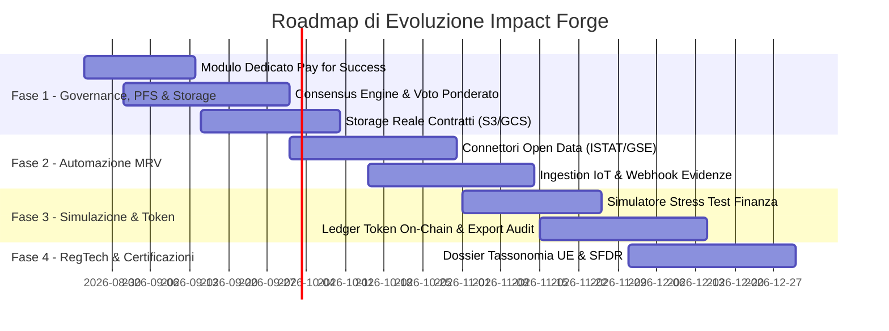

# Impact Forge — Stato Attuale, Pre-requisiti e Roadmap Strategica

Questo documento serve come riferimento permanente per lo sviluppo della piattaforma **Impact Forge (Venture Building OS)**.

---

## 1. Stato Attuale & Interventi Già Completati (DONE)

| Componente | Stato | Dettaglio Tecnico |
| :--- | :---: | :--- |
| **Server & Runtime** | ✅ **Risolto** | Risolto il blocco PostgreSQL tramite engine ibrido: supporto nativo **PGlite** (WASM embedded su `.data/pglite-db/`) e fallback/switch automatico a PostgreSQL remoto tramite `DATABASE_URL`. |
| **Schema Dati** | ✅ **Verificato** | 12 tabelle Drizzle ORM relazionali (`src/db/schema.ts`) con indici e chiavi esterne con cascade delete. |
| **Auto-Provisioning** | ✅ **Attivo** | DDL idempotente all'avvio in `src/db/schema-ddl.ts` (`ensureDbReady`). |
| **Dataset Demo & Seed** | ✅ **Attivo** | 10 utenti RBAC, 6 opportunità, 6 progetti completi, 19 KPI, 12 evidenze, transazioni e token con `npm run db:seed`. |
| **Mappatura Formule & Agenti AI** | ✅ **Completata** | Mappate tutte le 19 formule dell'applicazione e verificati i 6 Agenti AI (documentati in dettaglio in `docs/CALCOLI_E_FORMULE.md`). |
| **Simulatore Payback / Break-Even** | ✅ **Integrato nella UI** | Integrato il calcolo `breakEvenYears` (con e senza Grant) nel pannello interattivo `FinanceBuilder` (`src/components/finance-builder.tsx`). |
| **Modulo Pay for Success & SIB** | ✅ **Integrato & Operativo** | Calcolo del **Costo Unitario Outcome** ($10.000 €$), **Valore Netto Outcome** ($20.000 €$) e **Valore Sociale Lordo** ($30.000 €$) con indicatore BCR ($3.0x$) e form tranche adattivo dedicato per contratti SIB. |
| **Calcolatore Stima Controfattuale** | ✅ **Funzionante** | Form interattivo per parametrizzare Orizzonte temporale, Risparmi di spesa pubblica, Entrate fiscali, Benefici privati e tipo di evidenza scientifica/amministrativa con salvataggio nel KPI e tracciamento Audit Log. |
| **Creazione Progetti da Zero (Wizard)** | ✅ **Operativo** | Wizard guidato multi-step (Territorio, Bisogno & SDGs, Finanza & PFS, Outcome KPI) per creare nuove venture complete da zero con pre-configurazione del Pay for Success. |
| **Attivazione PFS su Tutti i Progetti** | ✅ **Operativo** | Card e modal dedicati per abilitare e configurare in qualsiasi momento il modello Pay for Success/SIB su progetti esistenti in fase di Co-Design / Foundry. |
| **Upgrade Agenti AI (Structurer & Underwriter)** | ✅ **Operativo** | Structurer con solutore vincolato ($\text{DSCR} \ge 1.25$, WACC analitico) e Underwriter con formula bancaria standard di **Basilea II/III** ($\text{EL} = \text{PD} \times \text{LGD} \times \text{EAD}$). |
| **Workflow State Machine & Override** | ✅ **Completato & Testato** | Guida interattiva ai criteri di transizione con scorciatoie rapide + pulsante di **Forzatura Amministrativa (Admin Override)** con tracciamento immutabile in Audit Log. |
| **Interattività & Eliminazione Completa** | ✅ **Operativa su Tutti i Form** | Aggiunta ed eliminazione interattiva di elementi in ToC, RACI, Business Model Canvas, KPI e Documenti, con banner e switch rapido di ruolo 1-click in modalità sola lettura. |
| **Analisi Token vs Euro nel Wallet** | ✅ **Risolta & Verificata** | Distinti i Token di outcome dal controvalore monetizzato in Euro (€) con visualizzazione certificata (`96 Token` · `Valore: 115.200 €`). |
| **Health API** | ✅ **Funzionante** | `/api/health` riporta lo stato di connessione e il tipo di database in uso (`embedded-pglite` vs `remote-postgresql`). |
| **Build & Typecheck** | ✅ **0 Errori** | `npm run typecheck` e `npm run build` passano con successo (exit code 0). |

---

## 2. Fase 0: Cose da Fare PRIMA di Applicare il Piano Strategico (NEXT STEPS)

Prima di implementare nuove funzionalità complesse, è opportuno validare e consolidare il prototipo attuale:

1. **Adeguamento Concettuale e Correzione Formule (COMPLETATO & VERIFICATO)**:
   - [x] **Risoluzione Incongruenza Token/Euro nel Wallet**: Distinti a livello visivo e transazionale i Token coniati (es. `96 Token`) dal controvalore monetizzato in Euro (`Valore: 115.200 €`) eliminando la dicitura incongruente `96 €`.
   - [x] **Integrazione Modulo Pay For Success (PFS) & SIB**: Creato il motore di calcolo `computePayForSuccess` e integrato il pannello dedicato in `FinanceBuilder` con metriche di **Costo Unitario per Outcome Finale**, **Tariffa Payer**, **Valore Sociale Unitario Lordo e Netto** e **Avanzamento Target di Liquidazione**.
   - [x] **Predisposizione Form Blended per PFS**: Aggiunto supporto e guida descrittiva per strumenti `SIB` / Pay for Success a rimborso condizionato con qualsiasi Payer (PA, Fondazione, Anchor privata).
2. **Validazione dei Modelli Finanziari con Esperti di Dominio**:
   - [ ] Revisione con esperti di finanza d'impatto delle formule di **Leva Blended**, **DSCR**, **WACC**, **SROI** (5 anni), **LM3** e **Expected Loss**.
3. **Test sui Criteri di Transizione Workflow**:
   - [ ] Collaudo dei vincoli bloccanti di `transitionChecks` e `bancabilityChecks` in `src/lib/workflow.ts` (es. requisiti minimi di stakeholder, firma term sheet, checklist DNSH).
4. **Scelta sulla Gestione Autenticazione**:
   - [ ] Decidere se mantenere il selettore rapido demo per presentazioni o integrare un provider auth reale (NextAuth, Supabase Auth, SPID/CIE).
5. **Scelta dell'Ambiente di Deploy**:
   - [ ] Mantenere la modalità standalone locale con PGlite oppure configurare un database cloud gestito (Neon/Supabase) per un'istanza di staging pubblica.

---

## 3. Piano Strategico di Evoluzione (FUTURE ROADMAP)

- **Fase 1: Pay For Success Engine, Consensus & Storage Reale**: Gestione contratti a risultato, voto ponderato multi-stakeholder per approvazione passaggi di stato e upload effettivo di file contrattuali.
- **Fase 2: Automazione MRV & Open Data**: Connessione alle banche dati territoriali (ISTAT BES, OpenCoesione) e telemetrie IoT per verifica automatizzata dei KPI.
- **Fase 3: Simulatore di Stress Testing**: Simulazioni Monte Carlo su tassi e flussi di cassa per finanza blended.
- **Fase 4: RegTech & Dossier Istituzionali**: Export automatizzato di documentazione per investitori conformi a SFDR e Tassonomia UE.

---

## 4. Registro delle Versioni (Changelog)

- **Version 1.0.0**: Prototipo funzionante con PGlite embedded e workflow di base.
- **Version 1.0.1**: Risolto problema di connessione PostgreSQL tramite engine ibrido: supporto nativo **PGlite** (WASM embedded su `.data/pglite-db/`) e fallback/switch automatico a PostgreSQL remoto tramite `DATABASE_URL`.
- **Version 1.0.2**: **Revisione Completa Algoritmi & Integrazione UI Payback**:
  - Mappatura completa di tutte le 19 formule e analisi approfondita dei 6 Agenti AI (documentata in `docs/CALCOLI_E_FORMULE.md`).
  - Integrazione e visualizzazione del calcolo del Payback con/senza Grant (`breakEvenYears`) nell'interfaccia `FinanceBuilder`.
- **Version 1.0.3**: **Analisi di Dominio SIB, Pay For Success (PFS) & Correzione Wallet Token**:
  - Individuata l'incongruenza concettuale del SIB sommato nel funding iniziale giorno 1.
  - Definizione del modulo **Pay for Success** con formule per **Costo Unitario per Outcome Finale**, **Valore Sociale per Outcome** e **Margine PFS**.
  - Individuata e specificata la correzione dell'incongruenza nel Wallet (visualizzazione di `96 €` invece di 96 Token di outcome con controvalore monetizzato).
  - Specificati i requisiti del Form di Finanza Blended per i contratti a risultato.